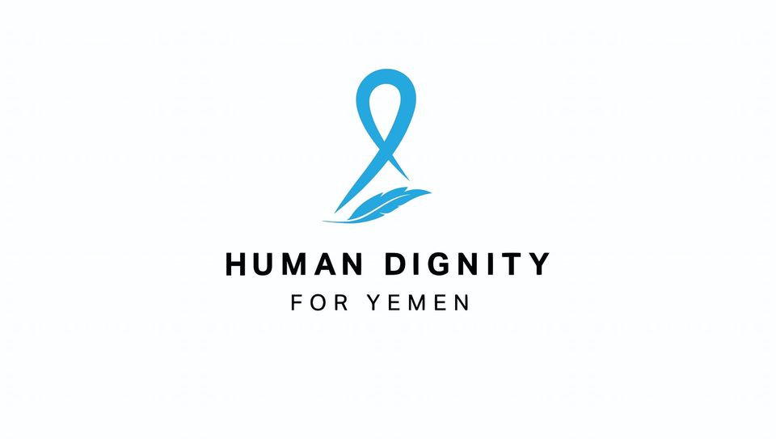

# Human-Dignity-For-Yemen

# Human Dignity for Yemen

## Introduction
The "Human Dignity for Yemen" project is a web application developed as a volunteer effort to support a non-profit organization dedicated to promoting human rights in Yemen. The project focuses on creating a user-friendly platform that displays the organization's activities and facilitates user registration to ensure a useful user experience.

- Deployed Site: [Human Dignity for Yemen](https://mertahrima.tech)
- Final Project Blog Article: [Read Blog](https://linktoyourblog.com)
- Author: Rima Mertah
- Author's LinkedIn: [Rima Mertah LinkedIn](https://www.linkedin.com/in/rima-m-507609227)

## Installation
To run the project locally, follow these steps:

1. Clone the repository: `git clone https://github.com/yourusername/Human-Dignity-For-Yemen.git`
2. Navigate to the project directory: `cd Human-Dignity-For-Yemen`
3. Install dependencies: `pip install -r requirements.txt`

## Usage
- Ensure you have completed the installation steps.
- Run the development server: `python manage.py runserver`
- Access the application in your web browser: `http://localhost:8000`

## Contributing
We welcome contributions! If you'd like to contribute to the project, please follow these guidelines:
1. Fork the repository.
2. Create a new branch: `git checkout -b feature/your-feature-name`
3. Make your changes and commit them: `git commit -m 'Add new feature'`
4. Push to the branch: `git push origin feature/your-feature-name`
5. Create a pull request.

## Related Projects
- [Django Framework](https://github.com/django/django) - The web framework used in this project.
- [REST framework](https://github.com/encode/django-rest-framework) - Used for building the API in Django.
- [Bootstrap](https://github.com/twbs/bootstrap) - Front-end framework for a responsive design.

.png>)
